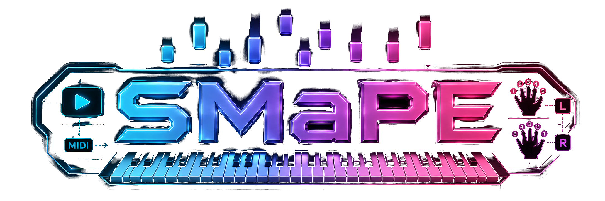

# SMaPE — Symple Midi and Playstyle Extractor

**Detect piano finger positions from videos.** Given a performance video (hands on keyboard, static camera) and the corresponding MIDI, SMaPE figures out which hand and finger played each note. Ships results in a `.symple` bundle for seamless import into [Symplethesia](https://app.symplethesia.com).



## Features

- **Finger position detection:** Detects hand/finger for each MIDI note via hand tracking (MediaPipe)
- **Video transcription:** No MIDI file? Generate one from audio using Kong high-res piano transcription model
- **Synthesia support:** Handles rendered keyboard videos with hand colors instead of real hands
- **Metadata & bundles:** Auto-fill song metadata (Artist, Title, Genre, Difficulty) and export as shareable `.symple` bundles
- **Interactive calibration:** Click a few keys (C/G) to calibrate the keyboard; accuracy improves with more points
- **Sync alignment:** See/hear the alignment with MIDI playback before committing to the slow hand-tracking phase
- **Desktop GUI:** Tkinter-based interface; no dependencies beyond Python stdlib for launching
- **Extensible output:** MIDI + finger position data bundled together for one-step import into Symplethesia

## Quick Start

```bash
# Install dependencies (venv required on Debian/Ubuntu — see "Install" section)
python3 -m venv .venv
source .venv/bin/activate
pip install -r requirements.txt

# Run the GUI
python3 gui.py
```

Or, command-line mode:

```bash
python3 extract_fingering.py --video performance.mp4 --midi performance.mid --out fingering.json
```

The video is only used to answer "which finger is on the key at each known
onset" -- the MIDI already gives exact pitch and timing. This is **not**
blind audio/video transcription... unless you pass `--transcribe`, which
generates the MIDI from the video's own audio using a piano-specific AMT
(automatic music transcription) model. See ["Transcription"](#transcription---transcribe) below.

## Install

Full install (on the machine that will actually run the analysis over
video). On Debian/Ubuntu the system Python is "externally managed" (PEP 668),
so a **virtual environment is required** — a plain `pip install` fails with
`error: externally-managed-environment`:

```bash
cd tools/piano-fingering
python3 -m venv .venv          # if this fails: sudo apt install python3-venv
source .venv/bin/activate      # prompt now shows (.venv)
pip install -r requirements.txt
```

Then always `source .venv/bin/activate` before running the tool
(`deactivate` to leave it).

Requirements: `mediapipe`, `opencv-python`, `numpy`, `mido`, `yt-dlp`, `librosa`.
(mediapipe supports Python ≤3.12 — your 3.12 is fine.)

`librosa` (used for audio-based sync, the default -- see "Sync" below) also
requires the system `ffmpeg` binary to be installed, since it's used to
extract the video's audio track:

```bash
sudo apt install ffmpeg   # Debian/Ubuntu
brew install ffmpeg       # Mac
```

(`ffmpeg` is available on most systems already.) If `ffmpeg`/`librosa` are
unavailable, pass `--sync-method press-moments` to use the older hand-motion
sync method instead, which doesn't need them.

Hand tracking uses MediaPipe's **Tasks API** (`HandLandmarker`), not the
legacy `mp.solutions.hands` API (which recent mediapipe pip releases
0.10.31+ broke/removed -- see mediapipe GitHub issue #6204). Because of
this, `requirements.txt` does not need to pin a specific mediapipe version;
any current pip release works.

The hand-landmark model file (`hand_landmarker.task`, ~10MB) is downloaded
automatically the first time you run the tool (needs network access on
that first run) and cached at `tools/piano-fingering/models/hand_landmarker.task`.
If the automatic download fails (e.g. no network access on the analysis
machine), download it manually from:

```
https://storage.googleapis.com/mediapipe-models/hand_landmarker/hand_landmarker/float16/latest/hand_landmarker.task
```

and place it at `tools/piano-fingering/models/hand_landmarker.task`.

### Install (transcription, `--transcribe`, optional)

Only needed if you want the tool to generate the MIDI itself from the
video's audio instead of supplying `--midi`. This is a separate, heavier
install -- skip it if you always have a MIDI file already.

Uses [`piano_transcription_inference`](https://github.com/qiuqiangkong/piano_transcription_inference)
(MIT license; checkpoint hosted on Zenodo, also unencumbered), the "Kong"
high-resolution piano transcription model. It depends on **PyTorch**, which
must be installed with the **CPU-only** wheel first -- a plain
`pip install torch` pulls a multi-GB CUDA build you don't need for this:

```bash
# inside the activated .venv, in addition to the main Install above:
pip install torch --index-url https://download.pytorch.org/whl/cpu
pip install piano_transcription_inference
```

The first `--transcribe` run downloads a **~165MB checkpoint** to
`~/piano_transcription_inference_data/` (needs network access **and** the
`wget` binary on PATH -- both one-time; the checkpoint is cached after
that). CPU inference is fine: a few minutes of solo piano audio typically
takes on the order of a minute or two on a modern CPU, no GPU required.

### Self-test only (no video libs needed)

The core geometry/sync/matching logic is pure numpy and has its own test
suite that runs with **only numpy installed** (no mediapipe/opencv/mido):

```bash
python3 -m pip install --user numpy
python3 selftest.py
# or:
python3 extract_fingering.py --selftest
```

## Usage

```bash
python3 extract_fingering.py \
  --video performance.mp4 --midi performance.mid \
  --out fingering.json
```

`--video`/`--midi` may be omitted entirely — a file dialog opens (rooted at
`~/Downloads`) to pick them. A bare filename is also resolved against
`~/Downloads`. `--video` can be a local file path or a YouTube (or any
yt-dlp-supported) URL — URLs are downloaded first via `yt-dlp` into a
`downloads/` folder next to the output JSON.

If `--out` is omitted, the output JSON defaults to the **same directory and
basename as `--midi`**, with a `.fingering.json` suffix -- e.g.
`--midi "/home/user/songs/piece.mid"` (no `--out`) writes
`/home/user/songs/piece.fingering.json`.

Full CLI:

```
--video PATH_OR_URL       local file or yt-dlp URL (file dialog if omitted)
--midi PATH               exact same performance as --video (file dialog if omitted; not used with --transcribe)
--transcribe              generate the MIDI from --video's own audio instead of requiring --midi (see "Transcription")
--midi-only               transcribe MIDI from --video's audio and stop there -- no calibration, no hand tracking,
                          no fingering/hand analysis. Implies --transcribe. Still writes a fingering JSON/.symple
                          bundle (empty notes list, "midiOnly": true) so the MIDI stays one-step-importable.
--onset-threshold F       --transcribe only: raise the model's onset-confidence cutoff (default 0.3) to reduce
                          ghost notes (see "Reducing ghost notes")
--min-velocity N          --transcribe only: drop transcribed notes quieter than this, 0-127 (default 0 = off)
--min-duration SECONDS    --transcribe only: drop transcribed notes shorter than this (default 0.0 = off)
--out PATH                output JSON path (default: <midi-directory>/<midi-basename>.fingering.json, or
                          ~/Downloads/<video-title>.fingering.json when --transcribe has no --midi to key off)
--offset SECONDS          manual video-vs-MIDI offset (video_time = midi_time + offset); seeds the aligner
--sync-method {audio,press-moments}  how to seed the offset (default: audio)
--no-align                skip the interactive video/MIDI alignment step (before tracking)
--no-bundle               don't write the .symple bundle (MIDI + fingering JSON) alongside --out
--preview                 also render preview.mp4 (keyboard overlay + fingertips + MIDI audio)
--fps N                   frame sampling rate for hand tracking (default 30)
--min-hand-confidence F   MediaPipe hand-detection confidence threshold, 0..1 (default 0.5); lower (e.g. 0.3)
                          if a hand frequently goes undetected -- see "Hand tracking" note below
--confidence-threshold F  drop matches below this confidence, 0..1 (default 0.0 = keep all)
--flip-handedness         swap detected L/R hand labels (see "Hand tracking" note below)
--low-pitch N             (optional) leftmost overlay key; default auto from MIDI
--high-pitch N            (optional) rightmost overlay key; default auto from MIDI
--selftest                run the pure-numpy self-tests and exit
```

> **Note on `--low-pitch`/`--high-pitch`:** with the C/G-key calibration
> below these no longer affect the mapping or the results — they're
> auto-derived from the MIDI and only size the on-screen keyboard overlay.
> They remain as optional overrides but you normally never set them.

### Hand tracking: left/right swapped?

If `--preview` shows the detected hands swapped (left tagged as right or
vice versa), pass `--flip-handedness`. This is a known MediaPipe quirk: its
handedness label assumes a mirror-selfie camera view, which doesn't always
match an overhead shot of the performer's own hands depending on camera
placement.

### Hand tracking: a hand frequently missing entirely?

If `--preview` shows one hand's dots vanishing for long stretches even
though it's clearly visible and playing (very low mean confidence, and a
`reconciliation:` summary line flagging a large fraction of notes as
`no-finger-support`, are the symptoms -- caught this way on a real run:
confidence dropped to ~0.02-0.08 and 86% of notes were flagged, while the
keyboard calibration overlay itself was pixel-accurate throughout), this is
MediaPipe's hand *detector* dropping a hand, not a calibration problem --
check by extracting a few frames from `preview.mp4` at the low-confidence
timestamps (`ffmpeg -ss T -i preview.mp4 -frames:v 1 out.jpg`) and looking
for whether both hands have colored fingertip dots.

**Likely cause on monochrome/black-and-white source video:** MediaPipe's
hand landmark model is trained mostly on color imagery and partly relies on
skin-tone cues that desaturated footage lacks, making detection less
confident and more prone to dropping a hand entirely for stretches.

**Fix:** lower `--min-hand-confidence` (default 0.5, the library's own
default) -- e.g. `--min-hand-confidence 0.3`. This relaxes both
`min_hand_detection_confidence` and `min_hand_presence_confidence`, trading
a higher false-detection rate for fewer missed real hands. Available in the
GUI too.

The tool prints a summary when done:

```
Summary:
  notes matched: 142/150
  mean confidence: 0.81
  offset used: 1.35s
```

## Calibration (multi-point, "click the C and G keys")

Every run opens a calibration window on the video's first frame. You click
the **centre of several white keys spread across the keyboard** — clicking
**C and G keys** is easiest because they're quick to identify by eye — and
for each click a small picker asks which key it was (C1…C8, G1…G8). Place at
least **4** points (more, spread wider, is better); the tool fits a **1-D
projective row map** from your clicks to screen pixels and draws the inferred
keyboard live so you can verify it lines up before finishing.

Controls:

- **Left-click** an empty spot → place a point (then pick which key).
- **Left-drag** a point → reposition it (generous 20 px grab radius).
- **Right-click**, or **Del / Backspace / x** on the selected point → remove
  a misplaced point.
- **Tab** cycles the selected point; **arrow keys** nudge it by 1 px.
- **U** undoes the last-placed point.
- **Esc** finishes (needs 4+ points).

**Why C/G clicks instead of the old 4 corners:** the corner method required
you to also state which pitch sat at each end (`--low-pitch`/`--high-pitch`),
and a single row of corner clicks can't constrain camera perspective in the
near↔far direction. Clicking real, labelled keys anchors actual pitches
directly to pixels, so the keyboard range no longer matters (it's auto-set
from the MIDI just to size the overlay), and the fit is well-posed from one
row. See the docstrings in `keyboard.py` (`_fit_row_projective`,
`interactive_calibrate`) for the geometry.

The fitted map is stored on the `Calibration` as a `row` field. The
`--calibration` path is currently a compatibility placeholder — calibration
runs interactively each time (it is not loaded from disk). Older 4-corner
`calibration.json` files still load and work via the corner-homography path;
only the interactive flow uses the row map.

**Stretch goal (not implemented):** automatic black/white key edge
detection from the image, to skip manual clicking entirely.

## Sync: video <-> MIDI offset

Because the video and MIDI are the **same performance**, the alignment
between them is a single constant time offset -- no time-warping/tempo
matching is needed. `video_time = midi_time + offsetSec`.

- **Interactive alignment (default, before tracking):** the offset is first
  seeded (manual or audio, below), then an alignment window opens where the
  video plays with the keyboard overlay and each note flashes its key at
  `start + offset`, while the **MIDI is played as beeps** (via `ffplay`) so
  you can *see and hear* whether the flashes/beeps land on the visible key
  presses. Nudge with ←/→ (10 ms) or ↑/↓ (50 ms), SPACE play/pause, `a`/`d`
  seek, `R` restart, ENTER to accept. This lets you fix the offset *before*
  committing to the slow per-frame hand tracking. Pass `--no-align` to skip
  it (e.g. headless runs).
- **Manual:** pass `--offset SECONDS` directly (e.g. if you already know
  how many seconds into the video the MIDI's t=0 falls). Overrides
  `--sync-method` entirely.
- **`--sync-method audio` (default):** the tool extracts the video's audio
  track (via `ffmpeg`) to a temporary `.wav` file, then uses `librosa`'s
  onset detection to find the first significant piano-sound onset. That
  onset time is compared against the MIDI's first note (`notes[0].start_sec`)
  to compute `offsetSec = audio_first_onset_time - midi_first_note_time`.
  This listens to the actual performance audio, so it's far more reliable
  than inferring key-presses from hand motion. Requires `ffmpeg` + `librosa`
  (see Install above). The temp `.wav` is deleted after use.
- **`--sync-method press-moments` (legacy fallback):** the tool detects
  "press moments" in the video -- moments where a tracked fingertip's
  downward motion stops (a local minimum of a descent), a proxy for the
  finger reaching a key -- and cross-correlates the density of those
  moments against the density of MIDI note onsets over a range of candidate
  offsets (±5s by default, 50ms bins), picking the offset that maximizes
  alignment. This is noisier than audio-based sync (it depends on accurate
  hand tracking); use it only if audio extraction fails or the video has no
  usable audio track. The estimate is printed either way; pass `--offset` to
  override it if it looks wrong.
- **`--preview`:** renders `preview.mp4` with the inferred **keyboard
  overlay** (white/black key ticks + note labels), detected fingertips
  (colored dots `L1`..`R5`), a red ring over the expected key of the note
  nearest each frame's synced time, **and a MIDI beep audio track** muxed in
  (via `ffmpeg`) so you can verify sync by ear as well as by eye.

## Transcription (`--transcribe`)

Don't have (or don't want to separately find) an exact-performance MIDI for
the video? `--transcribe` generates one straight from the video's own audio:

```bash
python3 extract_fingering.py --video performance.mp4 --transcribe
```

`--midi` is not needed (and is ignored if given) in this mode. This uses the
Kong high-resolution piano transcription model (see "Install (transcription)"
above for the one-time setup) to detect note pitch, onset/offset timing,
**velocity**, and **sustain-pedal** events directly from the audio -- a
solo-piano-specific model, meaningfully more accurate for this purpose than a
general-purpose audio-to-MIDI tool.

The transcribed MIDI is written to `<out-basename>.transcribed.mid` (next to
the output JSON) and then re-read through this tool's own `midi_io.py`
exactly like a user-supplied MIDI, so the rest of the pipeline (calibration,
alignment, hand tracking, matching) is completely unchanged. The written
`.transcribed.mid` also carries the model's sustain-pedal events as CC64 --
if you later import that MIDI into Symplethesia, the pedal comes along
automatically (see the app's pedal support).

**Offset is 0 by construction:** because the MIDI is derived from this exact
video's own audio, its timeline already IS the video's timeline -- there's no
separate offset to estimate, so the audio-onset (or press-moments) auto-sync
step is skipped. `--offset` still works as a manual override, and the
interactive alignment step (see "Sync" above) still runs by default in case
the model's own timing benefits from a small manual nudge; pass `--no-align`
to skip it.

**Honest expectations:** this is AI transcription, not a perfect transcript --
expect occasional missed/extra notes, quantization wobble, and pedal-inflated
note durations, especially on complex or fast passages. It's a strong draft to
clean up in Symplethesia's editor (or a future automated reconciliation pass
against the video's hand-tracking, which can help de-pedal and reject
ghost notes -- see `ai/tasks/003-amt-pedal-transcription/PLAN.md` Phase D),
not a finished score.

### Reducing ghost notes

Three knobs, all no-ops at their defaults (identical output to not passing
them at all), for when the transcription has more false-positive ("ghost")
notes than you'd like:

```bash
--onset-threshold 0.4    # model default is 0.3 -- higher = pickier about declaring a note at all
--min-velocity 15        # drop notes quieter than this (0-127) -- ghosts tend to be quiet (pedal resonance/harmonics)
--min-duration 0.05      # drop notes shorter than this (seconds) -- ghosts tend to be very short blips
```

`--onset-threshold` changes what the model itself decides is a note (fewer
false positives, but risk of losing quiet/ambiguous real notes too);
`--min-velocity`/`--min-duration` are a cheap independent post-filter applied
after transcription, on the assumption that ghost notes tend to be quiet
and/or short-lived. All three are exposed in the GUI too (enabled once
Transcribe is ticked).

**There's no universal "right" value** -- what counts as a ghost note depends
on the recording and the model's behavior on it. Tune by comparing against a
reference: if you have an export from another transcription tool (e.g.
Ivory) for the same video, a quick note-level diff (match by pitch + onset
time, after finding the constant offset between the two files' timelines --
they often don't start at the same silence-trimmed point) will show you
concretely how many notes disagree and whether a given threshold change
actually helped, rather than guessing.

## Matching

For each MIDI note onset:

1. Compute the synced video time (`onset_time_sec + offsetSec`).
2. Interpolate every tracked fingertip's screen position to that exact time
   (linear interpolation between the two nearest sampled video frames).
3. Convert both the note's pitch and every fingertip to a **continuous
   white-key index** (`screen_to_white_index` / `pitch_to_white_index`) —
   i.e. match in **depth-invariant keyboard-x space**, not raw 2-D pixels.
   A finger identifies a key by its position *along* the keyboard, not by how
   far down the key's depth it presses; matching in 2-D pixels penalises the
   natural depth spread of fingers and collapses confidence for every note.
4. Pick the fingertip nearest in key-index; emit a confidence in `[0, 1]`
   that decays with the mismatch in **white keys** (`confidence_from_distance`
   in `match.py`, characteristic scale `KEY_MATCH_SCALE ≈ 0.8` of a key). So
   confidence is now meaningful in key units: **>0.5 ≈ finger within half a
   key**; ~0.3 ≈ about one key off on average.

**Chord handling:** MIDI notes within 30ms of each other are grouped and
matched together (`group_simultaneous` in `match.py`) using greedy
nearest-first assignment so that no `(hand, finger)` pair is reused within
one chord (`resolve_chord_conflicts`).

**Held notes:** because matching is done independently per onset against
the fingertip positions *at that onset's synced time*, a sustained note
naturally keeps whichever finger/hand was nearest at the moment it was
struck (fingertip tracking after the onset doesn't change the recorded
assignment).

## Output JSON schema

```json
{
  "version": 1,
  "source": "<video path or url>",
  "midi": "<midi path>",
  "ppq": 480,
  "offsetSec": 0.0,
  "notes": [
    { "onsetTick": 0, "pitch": 60, "hand": "L", "finger": 1, "confidence": 0.87 }
  ]
}
```

- `onsetTick` -- tick position of the note-on, in the MIDI's own `ppq`
  (matches Symplethesia's tick units when `ppq` agrees; the importer joins
  on pitch + nearest tick within a tolerance regardless).
- `pitch` -- MIDI note number (0-127).
- `hand` -- `"L"` or `"R"`.
- `finger` -- `1`-`5` (1 = thumb, 5 = pinky).
- `confidence` -- `0.0`-`1.0`, derived from fingertip-to-key pixel distance.

## Output bundle (`.symple`)

Alongside `--out`'s fingering JSON, every run also writes a **`.symple`
bundle** next to it (same basename, e.g. `piece.fingering.json` ->
`piece.symple`) -- pass `--no-bundle` (or untick the GUI checkbox) to skip it.

A `.symple` file is a plain **ZIP** (written with Python's stdlib `zipfile`,
no new dependency) containing:

```
manifest.json    -- format version, generator, source video/midi, contents list
song.mid         -- the exact MIDI used for this analysis
fingering.json   -- the fingering analysis output (same as --out)
```

It's a plain zip specifically so both sides get a mature reader for free:
`zipfile` here, and Symplethesia's existing 7z-wasm-based archive reader in
the browser (`src/core/library/archive.ts`) on the app side -- no new
dependency there either. The manifest's `contents` list lets future versions
add more files (e.g. pedal data) without breaking older readers, which only
require `song.mid` to be present and treat everything else as optional.

**Loading a bundle in Symplethesia:** File -> Open -> pick the `.symple` file
(or drag it in). The app imports the bundled MIDI through the normal import
wizard, then automatically applies the bundled fingering -- equivalent to
importing the MIDI and using "Import fingering analysis (dev)" separately,
but one step. If the wizard is cancelled or the import fails, the fingering
is not applied (and nothing in the previously-open song is touched).

## Recent Improvements

- **Metadata support:** Song metadata (Artist, Title, Genre, Difficulty) is now stored in `.symple` bundles and imported directly into Symplethesia
- **Auto-fill metadata:** Extracts song info from video titles intelligently (supports "Artist - Song" patterns)
- **Better feedback:** Progress messages show what the tool is doing at each phase (download, calibration, transcription)
- **Enhanced UI:** Dialogs auto-fit to screen size; frame navigation with Page Up/Page Down (±150 frames)
- **Octave shifting:** Shift the entire keyboard calibration overlay by octave (< / > keys) when auto-detection is off by one
- **Finger position accuracy:** Each bundle includes accuracy notes and links to GitHub and Symplethesia

## GUI

A small desktop GUI (`gui.py`) wraps the CLI above so you don't have to
remember the flags. It's built with **Tkinter** (Python stdlib), so it has
no required dependencies beyond Python itself.

### Launching

```bash
python3 gui.py
```

`tkinter` itself doesn't need mediapipe/opencv/etc., so this launch command
works with **plain system Python** -- you do not need to be inside the
venv just to open the window. However, when you click **Run**, the GUI
needs the actual analysis dependencies to do anything useful. It handles
this automatically: at startup it looks for `.venv/bin/python` next to
`gui.py` and, if found, uses *that* interpreter to run
`extract_fingering.py` as a subprocess. If no `.venv` is found, it falls
back to the system Python and shows a yellow warning banner at the top of
the window telling you to install dependencies first (see "Install"
above) -- it will not silently fail or hide the problem.

Because the tool's calibration and alignment steps open blocking OpenCV
windows (click the C/G keys; watch/hear the alignment), the GUI always runs
`extract_fingering.py` as a **subprocess**, never by importing it, so those
windows can pop up and behave normally.

### Flow

The GUI is a multi-step wizard, styled to match the main Symplethesia app's dark theme:

1. **Video** -- paste a YouTube (or yt-dlp-supported) URL, **Open file...**
   to browse (defaults to `~/Downloads`), or drag a local file onto the
   field. Click **Next →**.
2. **What kind of video is this?** -- three buttons, each hoverable for a
   tooltip explaining what it needs/produces:
   - **Piano player** -- real hands on a real piano; you supply the
     exact-performance MIDI file on the next screen.
   - **Synthesia training video** -- a rendered keyboard with lit,
     colour-coded keys (no real hands); MIDI is transcribed from audio,
     hand (not finger) comes from key colour. See "Synthesia-render
     support" below.
   - **Extract MIDI only** -- transcribes MIDI from audio and stops there;
     no calibration, no hand/finger analysis (`--midi-only`).
3. **Metadata** -- fill in song information (Artist, Title, Genre, Difficulty). The **Auto-fill** button parses the video title to populate these fields automatically. Click **Next →**.
4. **Run** -- the MIDI-file field only appears here for "Piano player" mode.
   Click **Run**; stdout/stderr streams live into the scrollable log box.
   Click **Stop** to terminate a running analysis. When the process exits,
   the status line turns green with `Done -- wrote <path>` on success, or
   red with the failure/exit code on error (full details remain in the log
   above). "Open output folder" opens the output JSON's containing folder
   in your file manager. **← Back** returns to previous screens at
   any point. **↻ Restart** returns to the video selection screen.

A tooltip's **Don't show this again** checkbox persists across launches (in
`.gui_prefs.json`, next to `gui.py`, gitignored).

### Settings (gear icon)

Everything not covered by the 3-step flow lives behind the **⚙** icon,
pinned bottom-right and clickable at any time -- including mid-run, since it
opens as a separate, non-blocking window rather than a modal dialog:
Transcribe/Render mode overrides (secondary to the 3-button choice on page
2, for deviating from a preset), MIDI file, FPS, Offset, Sync method,
Calibration file (a compatibility placeholder -- see "Calibration" above),
Min hand confidence, Confidence threshold, Align video/MIDI before analysis,
Render preview video, Also write a `.symple` bundle, Flip render hand
colours, and the three ghost-note fields (Onset threshold, Min velocity,
Min duration -- see "Reducing ghost notes" above).

> The Low/High pitch fields and the on-screen 88-key picker were **removed** —
> with C/G-key calibration the range is auto-derived from the MIDI and no
> longer affects results.

### Drag-and-drop (optional)

By default the Video/MIDI drop zones work as simple "click to Browse"
buttons. For real OS-level drag-and-drop, install the optional
[`tkinterdnd2`](https://pypi.org/project/tkinterdnd2/) package:

```bash
pip install tkinterdnd2
```

(Install this into whichever Python environment you'll use to *launch*
`gui.py` -- it's unrelated to the `.venv` used for the actual video
analysis subprocess.) If `tkinterdnd2` isn't installed, `gui.py` detects
this at startup and falls back gracefully -- no crash, no required
dependency.

## Importing into Symplethesia

See `src/app/fingeringImport.ts` in the main app. In short: open the
Symplethesia app with the dev flag on (`?dev=1` in the URL, or
`localStorage.setItem('sympl.dev', '1')`), open the hamburger menu, and use
"Import fingering analysis (dev)" to pick the `fingering.json` produced by
this tool. It joins each JSON note to a project note by exact pitch match +
nearest `note.start` within `ppq/8` ticks, then applies hand + finger
assignments in two undo steps.

Alternatively, open the `.symple` bundle directly in Symplethesia (File → Open)
for one-step import with metadata and bundled MIDI.

## Support & Feedback

- **GitHub:** [github.com/petepiet/SMaPE](https://github.com/petepiet/SMaPE) — report issues, request features
- **Symplethesia:** [app.symplethesia.com](https://app.symplethesia.com) — the companion piano-learning app
- **Support the project:** [ko-fi.com/pieterg](https://ko-fi.com/pieterg)

---

**Created by Pieter Geljon**
